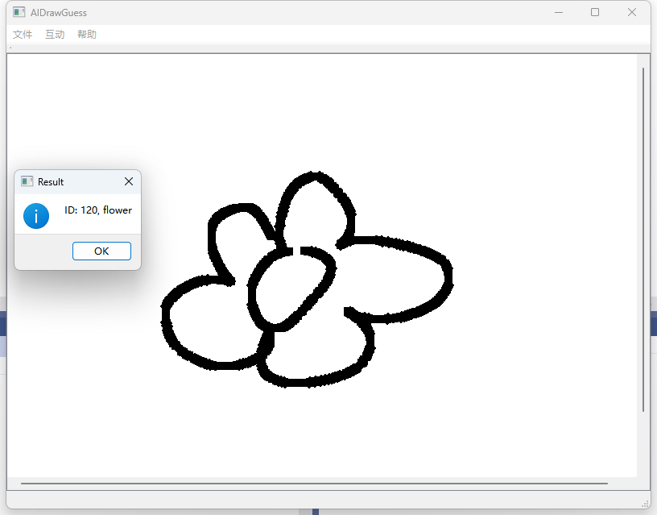

# AIDrawGuess
 A Draw Guess app use ai for infer.

# Requires
- MSVC >= 2017
- Qt >= 5.14.0
- onnxruntime >= 1.10
- VS2022(recommand)

# Install
## Step 1 Download Checkpoint
Download model from [kaggle](https://www.kaggle.com/code/fanbyprinciple/pytorch-doodle-puddle), you can train you self model.

## Step 2 Change model from Pytorch to ONNX
``` python
import torch
import torch.nn as nn
import torchvision
model = torchvision.models.resnet18()

a = torch.load("C:/Users/ASUS/Downloads/checkpoint_resnet18.pth", map_location=torch.device('cpu'))
def squeeze_weights(m):
    m.weight.data = m.weight.data.sum(dim=1)[:,None]
    m.in_channels = 1

model.conv1.apply(squeeze_weights)

num_classes = 340

model.fc = nn.Linear(512, out_features=num_classes, bias=True)
model.load_state_dict(a)
input_names = [ "image" ]
output_names = [ "cls_vector" ]
dummy_input = torch.randn(1,1,224,224, device="cpu")

torch.onnx.export(model, dummy_input, "resnet18.onnx", verbose=True, input_names=input_names, output_names=output_names)
```

## Step 3 Move file
Move file `resnet18.onnx` to dir `model`

## Step 4 Use VS to open
That's all, have fun!

# Example
